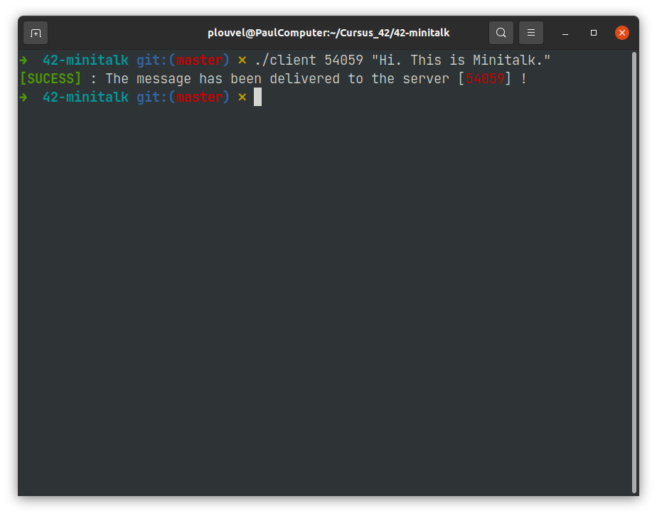
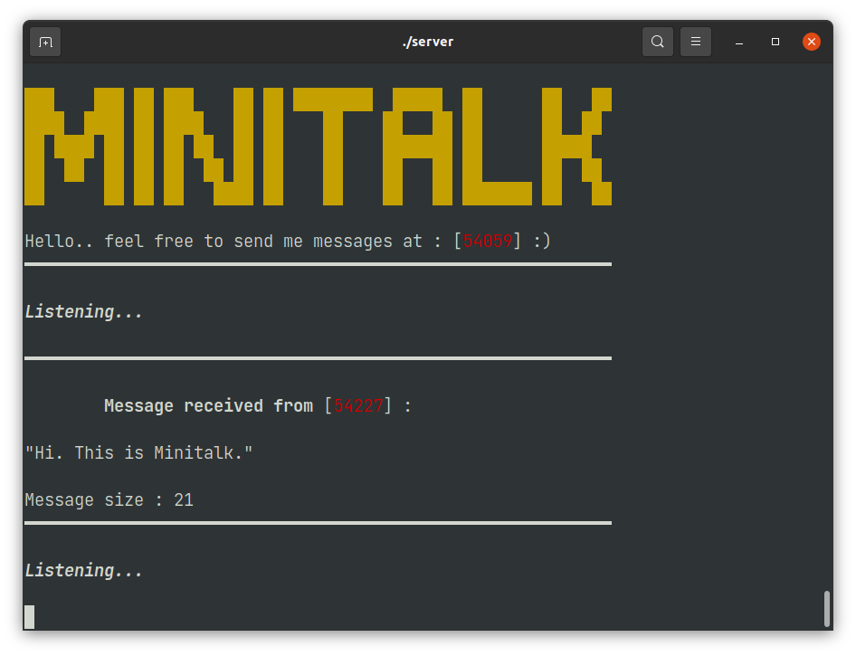

# 42-minitalk
A tiny client / server implementation only using two UNIX signal.


```
███    ███ ██ ███    ██ ██ ████████  █████  ██      ██   ██
████  ████ ██ ████   ██ ██    ██    ██   ██ ██      ██  ██  
██ ████ ██ ██ ██ ██  ██ ██    ██    ███████ ██      █████   
██  ██  ██ ██ ██  ██ ██ ██    ██    ██   ██ ██      ██  ██  
██      ██ ██ ██   ████ ██    ██    ██   ██ ███████ ██   ██ 
```

This minitalk can send over 10 000 chars in less than a second..

## Screenshot




## How does it works ?

The client is sending to the server the message using UNIX signal.

The goal is to break down an entire string into something we can actually send : raw binary data.

First, we break down each character (this project can be seen too as an introduction to [bitwise operator](https://en.wikipedia.org/wiki/Bitwise_operation)) by checking each bits. The client is then sending 1 and 0 with **SIGUSR1** and **SIGUSR2** respectively to the server.

My minitalk is *bufferized* : it sends the message lenght to the server before the sending the message data : the server dynamically allocates the message and fill it in real time.

By doing so, we respect the **subject requierement** that stipulates the message should be shown **ONLY** when the transmission has ended.

You should be carefull about error cases : 

* *How your server manages abrupt client closing* ?
* *How your client manages abrupt server closing* ?
* *Watch out for* **leaks** !
* *Are you using only [async-signal-safe](https://man7.org/linux/man-pages/man7/signal-safety.7.html) function in your signal handler ?*

**Don't hesitate to spice up your project !**

## Closing remarks

>	<cite>“La créativité est une fleur qui s’épanouit dans les encouragements mais que le découragement, souvent, empêche d’éclore.”</cite>
**Alex F. Osborn**
